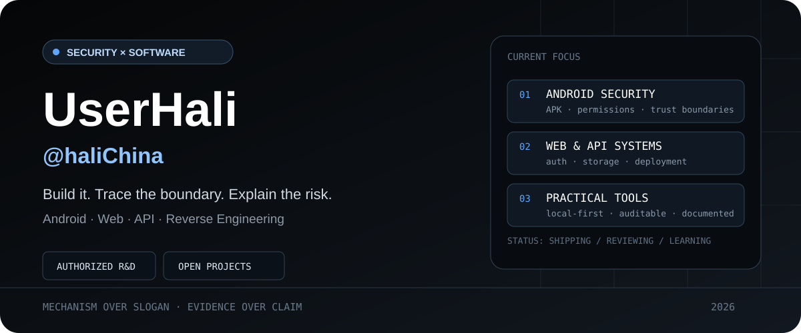
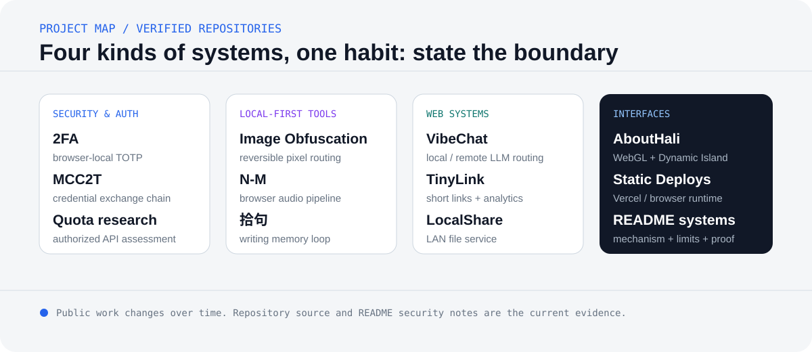

<p align="center">
  
</p>

<p align="center">
  <a href="https://userhali.com"><strong>Website</strong></a> ·
  <a href="https://status.userhali.com">Services</a> ·
  <a href="mailto:admin@userhali.com">Email</a>
</p>

## About

I build security-aware web systems, browser tools, and small utilities. My preferred workflow is straightforward:

```text
understand the mechanism → locate the trust boundary → state the limits
```

Current areas of interest include authorized security research, Android and APK analysis, authentication flows, browser storage, API design, and local-first software.

<p align="center">
  
</p>

## Selected work

### Security & authentication

- **[2fa](https://github.com/haliChina/2fa)** — browser-local RFC 6238 TOTP authenticator with an explicit storage and XSS boundary.
- **[MCC2T](https://github.com/haliChina/MCC2T)** — Microsoft Cookie → Xbox Live → XSTS → Minecraft token exchange through a Serverless API.
- **[new-api-quota-overflow](https://github.com/haliChina/new-api-quota-overflow)** — security research tooling for authorized quota-boundary assessment.

### Local-first browser tools

- **[Image-Obfuscation](https://github.com/haliChina/Image-Obfuscation)** — deterministic, reversible image-pixel permutation; visual obfuscation rather than cryptographic encryption.
- **[N-M](https://github.com/haliChina/N-M)** — encrypted music-file processing in browser memory, with documented external font/CDN boundaries.
- **[shiju](https://github.com/haliChina/shiju)** — a local-first writing library for collecting, organizing, retrieving, and revisiting quotations.

### Web systems

- **[VibeChat](https://github.com/haliChina/VibeChat)** — one chat client routing directly to local `llama.cpp` or remote OpenAI-compatible endpoints.
- **[tinylink-nextjs](https://github.com/haliChina/tinylink-nextjs)** — custom short links, redirect notices, PostgreSQL analytics, and a clearly documented unauthenticated management boundary.
- **[LocalShare](https://github.com/haliChina/LocalShare)** — streamed LAN file sharing from Node.js or a single Windows executable.

### Interfaces

- **[AboutHali](https://github.com/haliChina/AboutHali)** — WebGL sakura rendering and a multi-state Dynamic Island interface for [userhali.com](https://userhali.com).

## How I document projects

A useful README should make four things easy to find:

1. What the project actually does.
2. The shortest path to a successful first run.
3. Where credentials, files, and network requests cross boundaries.
4. What the project does **not** guarantee.

That is why the repositories above include architecture diagrams, deployment notes, and security limitations instead of relying only on feature lists.

## Working principles

- Authorized scope first.
- Evidence over assumptions.
- Local-first does not automatically mean offline or secret.
- A warning page is not a security guarantee.
- Browser storage is not a credential vault.
- Client-side rate limits are not server-side abuse protection.
- Small tools still deserve explicit trust boundaries.

## Stack

```text
TypeScript / JavaScript / React / Next.js / Node.js
HTML / CSS / WebGL / PostgreSQL / Vercel
Python / Android security / APK analysis / reverse engineering
```

## Contact

- Website: [userhali.com](https://userhali.com)
- Service status: [status.userhali.com](https://status.userhali.com)
- Email: [admin@userhali.com](mailto:admin@userhali.com)

> “Code is like humor. When you have to explain it, it’s bad.” — Cory House
